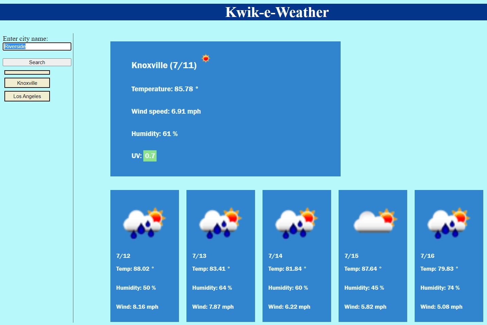

# Kwik-e-Weather
https://salvadorbanuelos424.github.io/Kwik-e-Weather/

## Purpose
Check weather, forecast, UV, and humidity from any city.  Take full advantage of localStorage to save previously searched locations.  The app uses fetch(API)'s to keep up to date with the forecast.

Check the weather.  It's fast and easy so give it a try!

## Installation
* Git clone repository from 
* no npm installation

## Built With
* HTML 
* CSS
* JS

## Website

## Contributing
Open to all contributions

## Questions
Feel free to reach out GitHub or email if you have any questions

## GitHub URL
https://github.com/SalvadorBanuelos424/Kwik-e-Weather

## Email
* SBanuelos1234@gmail.com

Made with ❤️ by Salvador Banuelos
### © 2022 Kwik-e-Weather, Inc.